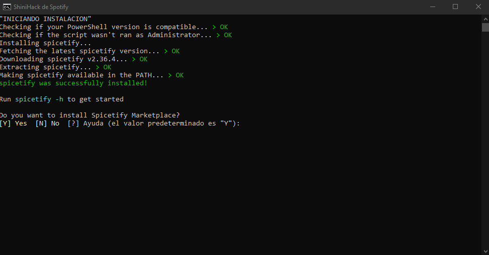
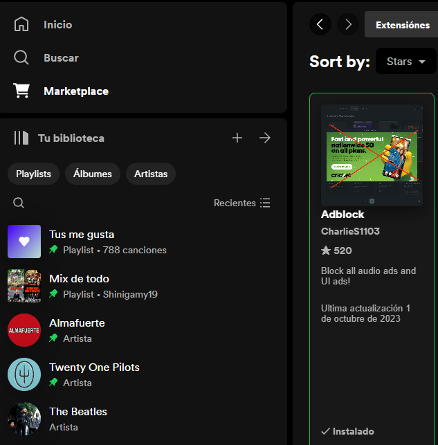

# SpotyHack-Script
 Un pequeño script para hackear spotify utilizando <a href="https://spicetify.app">Spicetify</a>

<h1>Instucciones</h1>

¿No te gusta leer? Apreta la imagen.

<h3>¿Como Usar?</h3>

<ol>
<li>Descargamos <a href="https://open.spotify.com/download">Spotify</a> de su pagina oficial</li>
<strong><em> Solo funciona desde su pagina oficial, en caso de tenerlo instalado desde Microsoft Store deben desinstalarlo.</em></strong>
<li>Una vez instaldo Spotify, recomiendo que inicien seccion en su cuenta.</li>
<li>Cerramos Spotify (Verifiquen administrador de tareas)</li>
<li>Descargamos y ejecutamos el <a href="https://github.com/Shinigamy19/SpotyHack-Script/blob/main/SpotyHack.bat">Script</a>.</li>

<li>Nos aseguramos de instalar Spicetify Marketplace presionando "Y"</li>
<li>Instalamos el Adblock desde Marketplace</li>

<li>A escuchar musica.</li>
</ol>

<h3>¿Eso es todo?</h3>

<b>¡Nope!</b> El script les va a servir para cuando se actualice spotify.

Cuando la app se actualiza el market desaparece. Entonces lo que hay que hacer es cerrar la app completa y ejecutar nuevamente el script.

<h3>Muchos de nada!</h3>
<h4 align="center">Si me queres ayudar, pone una estrellita, dale me gusta y suscribite a mis redes.</h4>

